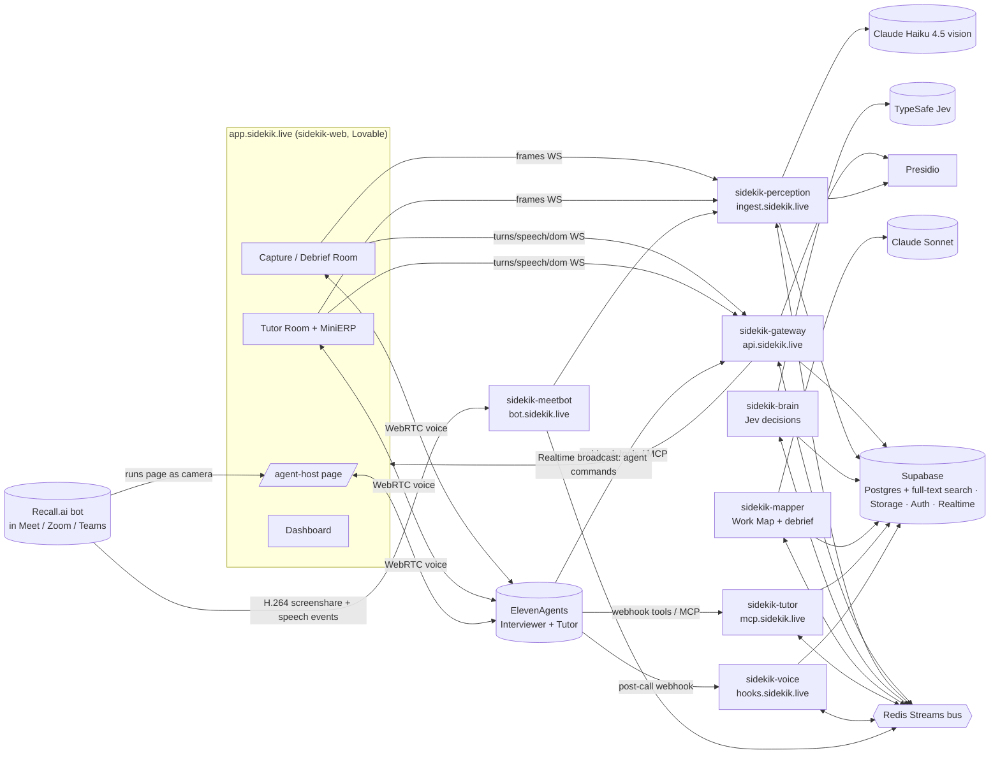
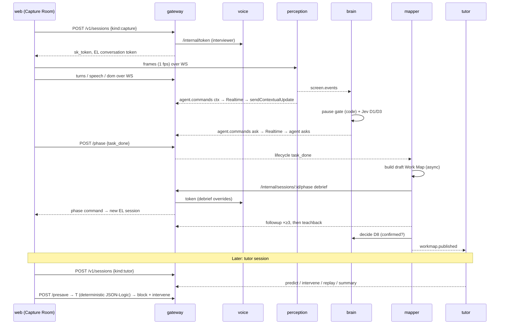

# Sidekik: System Architecture (v0.3.3)

> **Sidekik** is an AI apprentice. It watches an expert work on their screen and asks why at the right moments. It turns that session into a Work Map, then coaches the next hire through the same work on their own screen.
> Hack-Nation 7th Global AI Hackathon, Challenge 01 (ElevenLabs) · Domain: **sidekik.live** (Cloudflare) · Team: **Sahil, Aadil, Mayukh**
> **Source of truth: the `sidekik-docs` repo.** Every code repo carries synced copies in `docs/`, refreshed with `scripts/sync-docs.sh` from sidekik-docs.

---

## 1. How to use these docs

Every repo contains the same set of files, so Claude Code always has full context:

| File | What it is |
|---|---|
| `CLAUDE.md` (repo root) | Claude Code's entry point. It imports the three files below and sets the repo's rules. |
| `docs/DESIGN.md` | The build spec for **this** repo: endpoints, pipeline, env vars, ordered tickets, definition of done |
| `docs/ARCHITECTURE.md` | This file: the whole system, contracts (§5 + Appendices A–B), ownership, domains, timeline |
| `docs/SCHEMA.md` | Every table, column and policy |
| `docs/KICKOFF.md` | Copy-paste prompts for the person running Claude Code in this repo |

Two rules:

- **Payload shapes are defined once,** in `sidekik-platform` (the npm package `@sidekik/contracts`). If a doc and the package disagree, the package is correct.
- The `docs/` files in each code repo are **copies**. The source is the `sidekik-docs` repo. Change a doc there by PR (see its `CONTRIBUTING.md`), then run `scripts/sync-docs.sh` to update the code repos.

---

## 2. Architecture at a glance



**Model providers:** every LLM and vision call our services make uses the **Claude API** with the team's `ANTHROPIC_API_KEY`, server-side only:
- Haiku 4.5 for vision and fast drafting
- Sonnet 5.5 for building the Work Map

Jev (TypeSafe) is the only other model vendor. The voice agents' LLM runs inside ElevenLabs (see sidekik-voice DESIGN §3). Retrieval uses Postgres full-text search, so there is no embeddings vendor.

**Core design rule:** the ElevenAgents voice session always runs in a browser page. That page is the Capture Room, the Tutor Room, or `/agent-host` running inside the Recall meeting bot. No backend service streams audio. Services decide *what the agent should do* and publish an **agent command**. The gateway forwards each command to the page, and the page tells the agent. Because of this, browser mode and meeting mode share one code path.

---

## 3. Repos and ownership (3 per person)

| # | Repo | Kind | Owner | Reviewer | Public host | Brief module |
|---|---|---|---|---|---|---|
| 0 | `sidekik-docs` | documentation only: this file, SCHEMA.md, every repo's DESIGN/KICKOFF/CLAUDE.md starters | **all three** | the affected owner | none | all |
| 1 | `sidekik-platform` | npm package (`@sidekik/contracts`) + DB migrations + dev infra + Presidio config | **Sahil** | Mayukh | none | all |
| 2 | `sidekik-perception` | service: frames → screen events, keyframes, clips | **Sahil** | Mayukh | `ingest.sidekik.live` | Capture |
| 3 | `sidekik-brain` | service: Jev decision layer, pause detector, question planner | **Sahil** | Mayukh | private | Capture + Teach |
| 4 | `sidekik-web` | Lovable app: dashboard, rooms, MiniERP, agent-host | **Aadil** | Sahil | `app.sidekik.live` | all UI |
| 5 | `sidekik-voice` | service + ElevenAgents config-as-code | **Aadil** | Sahil | `hooks.sidekik.live` | voice |
| 6 | `sidekik-meetbot` | service: Recall.ai connector | **Aadil** | Sahil | `bot.sidekik.live` | meeting platforms |
| 7 | `sidekik-gateway` | service: public API, sessions, consent, off-record, egress, cost, replay | **Mayukh** | Aadil | `api.sidekik.live` | trust + glue |
| 8 | `sidekik-mapper` | service: Work Map builder, debrief, guardrail compiler, publish | **Mayukh** | Aadil | private | Map |
| 9 | `sidekik-tutor` | service: tutor runtime, rule engine, pre-save check, mastery, MCP | **Mayukh** | Aadil | `mcp.sidekik.live` | Teach |

Each person owns one slice of the product end to end:

- **Sahil, "eyes and judgment":** what is on screen, when to ask, and what to ask. This includes the Jev integration.
- **Aadil, "face and voice":** everything the user sees and hears, including the agents and the meeting bot.
- **Mayukh, "memory and teaching":** sessions and trust, the Work Map, and the tutor.

Reviews rotate: Sahil reviews Aadil, Aadil reviews Mayukh, and Mayukh reviews Sahil. Every PR to `main` needs one approval, and the reviewer is in CODEOWNERS.

### Honest tradeoff

Nine repos for three people in 24 hours means integration is the main risk, more than any single feature. Three rules keep it manageable:

1. **Contracts first.** `@sidekik/contracts@0.1.0` is tagged by H1.5. After that, any payload change needs a version bump and a message in the team chat.
2. **Every service runs alone.** Each one boots against `sidekik-platform/dev/docker-compose.yml` (Redis + Presidio) and recorded bus fixtures, with no dependency on teammates' services.
3. **Three integration checkpoints: H6, H14, H18.** At each one, all three people stop and get the end-to-end path working before continuing (§11).

---

## 4. How services talk

### 4.1 Channels

| Channel | Tech | Used for |
|---|---|---|
| Event bus | **Redis Streams** (one stream per event type, one consumer group per service) | everything asynchronous within a session |
| Internal HTTP | private network + `X-Internal-Token` | request/response calls (decide, pre-save check, token, clips) |
| Browser push | **Supabase Realtime broadcast** on channel `session:{sid}`. **Only the gateway publishes to it.** | agent commands to the page |
| Browser → backend | WebSocket to gateway `/ws/client/:sid` (JSON) and a binary WebSocket to perception `/ws/frames/:sid` | turns, speech signals, DOM events, frames |

### 4.2 Streams

| Stream key | Producer(s) | Consumers | Payload type |
|---|---|---|---|
| `sk:session.lifecycle` | gateway, meetbot | all services | `SessionLifecycle` |
| `sk:transcript.turns` | gateway (already redacted and off-record filtered) | voice (persists), brain, mapper, tutor | `TranscriptTurn` |
| `sk:speech.signals` | gateway, meetbot | brain, tutor | `SpeechSignal` |
| `sk:dom.events` | gateway | perception | `DomEvent` |
| `sk:screen.events` | perception | brain, tutor, mapper, gateway (replay) | `ScreenEvent` |
| `sk:agent.commands` | perception (`ctx`), brain (`ask`), mapper (`followup`, `teachback`), tutor (`predict`, `intervene`, `replay`, `summary`) | gateway; perception (reads `ask` to keep keyframes around each question) | `AgentCommand` |
| `sk:workmap.published` | mapper | voice, tutor | `WorkMapPublished` |
| `sk:usage` | every service | gateway (cost ledger) | `UsageRecord` |

Each stream is capped with `MAXLEN ~ 10000`. Consumers use `XREADGROUP` with `BLOCK 1000` and acknowledge each entry with `XACK` after handling it. All handlers must be idempotent, keyed on `event.id`. The `bus.ts` helper in `@sidekik/contracts` implements this; services should use it rather than writing their own.

### 4.3 Internal HTTP calls

| Caller → Callee | Endpoint | Budget |
|---|---|---|
| gateway → voice | `POST /internal/token` | 500 ms |
| gateway → meetbot | `POST /internal/bots`, `DELETE /internal/bots/:sid` | 3 s |
| gateway → tutor | `POST /internal/presave` | **300 ms** |
| gateway → mapper | `POST /internal/workmaps/:id/publish`, `GET /internal/workmaps/:id/export`, `POST /internal/tools/recall_context` | 1 s, or async job |
| gateway → tutor | `POST /internal/tools/*` (EL webhook tool proxy) | 800 ms |
| mapper, tutor → brain | `POST /internal/decide` | 600 ms |
| mapper → perception | `POST /internal/clips` | async job |
| mapper → gateway | `POST /internal/sessions/:id/phase` | 1 s |
| brain → gateway | `POST /internal/sessions/:id/off-record` | 200 ms |
| voice → gateway | `POST /internal/redact` (webhook turns) | 300 ms |
| meetbot → gateway | `POST /internal/agent-host-token` | 200 ms |
| meetbot → perception | `WS /internal/frames/:sid` | streaming |
| gateway, perception → Presidio | analyzer / anonymizer / image-redactor | 300 ms |

Request/response schemas for every endpoint above are in `@sidekik/contracts` (`contracts/api.ts`). Shapes marked draft there are for the owning service to confirm.

### 4.4 Auth

| Hop | Mechanism |
|---|---|
| User → gateway | Supabase Auth JWT (`Authorization: Bearer`), verified with `supabase.auth.getUser()` |
| Browser → gateway WS / perception WS | `sk_token`: HS256 with `SK_SESSION_SECRET`, 2 h TTL, claims `{sid, org, role, kind}`, minted by gateway |
| Service ↔ service | `X-Internal-Token: $SK_INTERNAL_TOKEN`; internal routes only accept calls from the private network |
| ElevenLabs post-call webhook → voice | ElevenLabs HMAC signature |
| ElevenLabs webhook tools → gateway | header `X-Sidekik-Tool-Secret`, set in the tool config |
| ElevenLabs MCP → tutor | bearer `SK_TOOL_SECRET` |
| Recall → meetbot | webhook secret + `?secret=` on the realtime WebSocket |
| Recall agent-host page | one-time `t` in the URL, exchanged at gateway `POST /v1/agent-host/claim` for an `sk_token` |

### 4.5 Agent commands: the only way the agent speaks

Services publish commands to `sk:agent.commands`. The gateway checks the off-record state and broadcasts allowed commands to `session:{sid}`. The page then acts:

| `type` | Published by | Page action |
|---|---|---|
| `ctx` | perception | `sendContextualUpdate(text)` (never spoken) |
| `ask` | brain | `sendUserMessage("[SIDEKIK] ASK: <text>")` |
| `followup` | mapper | `sendUserMessage("[SIDEKIK] FOLLOWUP: <text>")` |
| `teachback` | mapper | `sendUserMessage("[SIDEKIK] TEACHBACK: <script>")` |
| `predict` | tutor | `sendUserMessage("[SIDEKIK] PREDICT: <step>")` |
| `intervene` | tutor | `sendUserMessage("[SIDEKIK] INTERVENE: <guardrail + quote>")` + highlight the field |
| `replay` | tutor | open the clip overlay with the expert's quote |
| `summary` | tutor | `sendUserMessage("[SIDEKIK] SUMMARY: …")` + show the mastery panel |
| `offrecord` | gateway | mute mic, show red badge, stop sending frames |
| `phase` | gateway | end the current EL session and start a new one with the token in the payload (capture → debrief) |

While off-record is on, the gateway **drops** every command except `offrecord`.

---

## 5. Contracts (summary; source of truth is `sidekik-platform/src/contracts`)

```ts
// Every bus event
type Envelope<T> = {
  id: string;            // ulid
  type: string;          // e.g. "screen.event"
  v: 1;
  org_id: string; session_id: string;
  t_ms: number;          // ms since session start
  ts: string;            // ISO wall clock
  producer: "gateway"|"perception"|"brain"|"mapper"|"tutor"|"voice"|"meetbot";
  data: T;
};

type SessionKind = "capture" | "tutor";
type Phase = "capture" | "building" | "debrief" | "confirmed" | "tutoring" | "done";

type SessionLifecycle = { event: "started"|"task_done"|"phase_changed"|"offrecord_on"|"offrecord_off"
  |"ended"|"bot_joined"|"bot_left"|"bot_error"; kind: SessionKind; phase: Phase;
  workflow_id: string; workmap_id?: string; mode: "browser"|"meeting"|"replay"; language: string };

type TranscriptTurn = { turn_id: string; role: "user"|"agent"; text: string; lang: string;
  source: "live"|"webhook"; redacted: true };

type SpeechSignal = { kind: "user_speech_start"|"user_speech_end"|"agent_speech_start"
  |"agent_speech_end"|"typing"; source: "sdk"|"recall"|"dom" };

type DomEvent = { kind: "field_focus"|"field_change"|"save_attempt"|"record_open";
  record?: { kind: string; id: string }; field?: string; before?: string; after?: string;
  state?: InvoiceState };

type ScreenEvent = { event_id: string; type: "app_opened"|"record_opened"|"field_changed"
  |"button_clicked"|"value_read"|"navigation"|"dialog"|"typing_in_progress"|"idle";
  entity?: { kind: string; id: string }; field?: string; before?: string; after?: string;
  state: ScreenState; confidence: number; source: "vision"|"dom"; keyframe_id?: string;
  untrusted_screen_text?: string };

type InvoiceState = { invoice_id?: string; supplier?: string; supplier_known?: boolean;
  net_amount?: number; currency?: string; invoice_date?: string; invoice_month?: number;
  company_code?: string; category?: string; cost_center?: string; asset_number?: string;
  approvals_count?: number };

type AgentCommand =
  | { type: "ctx"; text: string; context_id?: string }
  | { type: "ask"; question_id: string; text: string; qtype: QType }
  | { type: "followup"; open_item_id: string; text: string }
  | { type: "teachback"; workmap_id: string; script: string }
  | { type: "predict"; step_id: string; prompt: string }
  | { type: "intervene"; guardrail_id: string; step_id: string; text: string; field?: string }
  | { type: "replay"; step_id: string; clip_url: string; quote: string; label: string }
  | { type: "summary"; mastery: MasterySummary }
  | { type: "offrecord"; on: boolean }
  | { type: "phase"; phase: Phase; conversation_token: string; agent_id: string;
      dynamic_variables: Record<string,string> };

type DecisionRequest  = { session_id: string; decisions: { id: DecisionId; state: unknown }[] };
type DecisionResult   = { id: DecisionId; answer: string|number|boolean; probabilities?: Record<string,number>;
  confidence: number; provider: "jev"|"openrouter-jev"|"llm"; escalated: boolean; latency_ms: number;
  answers?: Record<string, QuestionAnswer> };   // every question of the decision; `answer` is the first question's
type QuestionAnswer   = { answer: string|number|boolean; confidence: number; probabilities?: Record<string,number>;
  p_true?: number /* noul */; score?: number /* score: weighted level, 1-based */ };
type DecisionId = "D1"|"D2"|"D3"|"D4"|"D5"|"D6"|"D7"|"D8"|"D9"|"D10"|"D11"|"D12";

type WorkMapPublished = { workmap_id: string; workflow_id: string; version: number };
type UsageRecord = { service: string; vendor: "elevenlabs"|"typesafe"|"anthropic"|"recall";
  units: number; unit: "tokens_in"|"tokens_out"|"minutes"|"hours"; cost_usd: number;
  counterfactual_usd?: number };
```

The remaining types (`QType`, `ScreenState`, `WorkMap`, `Step`, `Guardrail`, `Evidence`, `OpenItem`, `MasterySummary`) and the decision specs D1–D12 are in the appendices at the end of this file. Every one of them lives in the contracts package.

The database columns behind all of this are in `docs/SCHEMA.md`.

---

## 6. Data ownership (Supabase, one project)

All tables live in `public` because Lovable reads `public`. Every table has `org_id uuid not null` and RLS enabled. **Each service writes only to its own tables but may read any table.** Migrations live in `sidekik-platform/supabase/migrations`, and CODEOWNERS sends each migration file to its owner for review.

| Owner service | Tables |
|---|---|
| gateway (Mayukh) | `orgs`, `org_members`, `experts`, `learners`, `workflows`, `sessions`, `consent_records`, `off_record_spans`, `cost_ledger`, `replay_events` |
| voice (Aadil) | `transcript_turns`, `agent_configs` |
| meetbot (Aadil) | `meeting_bots` |
| perception (Sahil) | `screen_events`, `keyframes`, `clips` |
| brain (Sahil) | `questions`, `answers`, `decisions_log` |
| mapper (Mayukh) | `work_maps`, `work_map_steps`, `guardrails`, `step_evidence`, `open_items`, `kb_chunks` (full-text search), `expert_memory` |
| tutor (Mayukh) | `learner_attempts`, `interventions`, `mastery`, `gap_flags` |

**Storage buckets** (all private; access only through signed URLs with a 10-minute TTL):

- `captures/org/{org}/sessions/{sid}/keyframes/{t_ms}.webp`
- `captures/org/{org}/sessions/{sid}/clips/{step_id}.mp4`
- `workmaps/org/{org}/{workmap_id}/v{n}/workmap.json | AGENT_RULES.md | guardrails.jsonlogic.json`
- `replays/{sid}/bundle.json`

---

## 7. Domains and deployment

### 7.1 Cloudflare DNS for `sidekik.live`

| Host | Points to | Proxy | Notes |
|---|---|---|---|
| `sidekik.live` | redirect rule → `app.sidekik.live` | proxied | landing page later |
| `app` | Lovable custom domain target | **DNS-only** (grey cloud) | follow Lovable's custom-domain steps; Lovable issues its own certificate |
| `api` | gateway | proxied | REST + `/ws/client` WebSocket |
| `ingest` | perception | proxied | binary frames WebSocket |
| `hooks` | voice | proxied | ElevenLabs post-call webhook |
| `bot` | meetbot | proxied | Recall webhooks + realtime WebSocket |
| `mcp` | tutor | DNS-only to start | MCP streaming is simplest without a proxy; switch to proxied once it's verified |

Cloudflare settings and caveats:

- **SSL/TLS:** set the mode to **Full (strict)**.
- **WebSockets:** on (the default).
- **Proxied HTTP times out after 100 s** (error 524). Any call that can take longer, such as the Work Map build, must run as an **async job** with status pushed over Realtime.
- **Proxied WebSockets can drop** when Cloudflare deploys. The page must auto-reconnect with backoff and resume sending from the last `t_ms`.
- **Certificates on a new custom-domain host:** if the host's certificate won't issue, set the record to DNS-only, wait for the certificate, then turn the proxy back on.

### 7.2 Hosting (recommended; the team decides)

- **Railway:** one project named `sidekik` with one service per backend repo, each auto-deploying from `main`.
  - Add the Redis plugin, plus Presidio analyzer, anonymizer and image-redactor as image services.
  - Services reach each other over Railway's private network (`<service>.railway.internal`). Services must listen on `::`.
- **Supabase:** your own Pro project (not Lovable Cloud), connected to Lovable through the Supabase connector before any tables exist.
- **Fly.io** works the same way if you prefer it. Cloudflare Workers can't run `sharp`, `ffmpeg` or Presidio, so the heavy services can't move there. The gateway could, but that isn't worth it this weekend.
- If you want Cloudflare in the data path, Jev is also served on Cloudflare Workers AI (`typesafe/jev`). That makes it a ready fallback provider for brain.

### 7.3 Secrets matrix (✓ = needed)

| Secret | gateway | perception | brain | mapper | tutor | voice | meetbot | web |
|---|---|---|---|---|---|---|---|---|
| `SUPABASE_URL` / `SUPABASE_SERVICE_ROLE_KEY` | ✓ | ✓ | ✓ | ✓ | ✓ | ✓ | ✓ | |
| `VITE_SUPABASE_URL` / `VITE_SUPABASE_ANON_KEY` | | | | | | | | ✓ |
| `REDIS_URL` | ✓ | ✓ | ✓ | ✓ | ✓ | ✓ | ✓ | |
| `SK_INTERNAL_TOKEN` | ✓ | ✓ | ✓ | ✓ | ✓ | ✓ | ✓ | |
| `SK_SESSION_SECRET` | ✓ | ✓ | | | | | | |
| `SK_TOOL_SECRET` | ✓ | | | | ✓ | ✓ | | |
| `TYPESAFE_API_KEY` (+ `OPENROUTER_API_KEY` fallback) | | | ✓ | | | | | |
| `ANTHROPIC_API_KEY` | | ✓ | ✓ | ✓ | | | | |
| `ELEVENLABS_API_KEY`, `EL_*_AGENT_ID`, `EL_WEBHOOK_SECRET` | | | | | | ✓ | | |
| `RECALL_API_KEY`, `RECALL_REGION`, `RECALL_WS_SECRET` | | | | | | | ✓ | |
| `PRESIDIO_*_URL` | ✓ | ✓ | | | | | | |

Store secrets only in the Railway (or Fly) environment, one shared variable group per environment. **Never put secrets in the Lovable repo**: it only gets the anon key and public URLs.

---

## 8. End-to-end sequence



---

## 9. Build timeline (24 h)

| Hours | Sahil (platform · perception · brain) | Aadil (web · voice · meetbot) | Mayukh (gateway · mapper · tutor) |
|---|---|---|---|
| **0–1.5** | Contracts + `bus.ts` + `auth.ts`, tag `v0.1.0`; docker-compose | Lovable project on own Supabase; auth; org/workflow pages | Migrations + RLS + seed (demo org, Sabine, Lena); Railway project, Redis, DNS |
| **1.5–6** | perception: frame WS, pHash diff, vision benchmark, `screen.events`, `ctx` | voice: both agents pushed, `/internal/token`; web: Capture Room (screen + EL SDK + Realtime handler) | gateway: sessions, `sk_token`, `/ws/client`, Presidio on turns, Realtime egress |
| **H6 ✅** | **Checkpoint 1: browser → frames → event → brain asks → agent speaks a grounded question at a pause** | | |
| **6–10** | brain: D1–D7, planner, off-record D7, `decisions_log`; perception: keyframes + redaction | web: live timeline, consent, off-record UI; voice: post-call webhook, transcript persistence | mapper: builder (Sonnet), validation, open items; gateway: phase API, off-record, consent |
| **10–14** | perception: clips job; brain: `/internal/decide` generic + D6/D8/D12 | web: Work Map page + clip player; voice: KB + Procedures sync on `workmap.published` | mapper: debrief driver, teach-back, publish, JSON-Logic compile + tests |
| **H14 ✅** | **Checkpoint 2: confirmed Work Map, every step with a screen moment and the expert's words** | | |
| **14–18** | brain: D9–D11; perception: tutor-mode tuning | web: Tutor Room + MiniERP pre-save hook + replay overlay | tutor: step tracker, rule engine, `/internal/presave`, predict loop, MCP |
| **H18 ✅** | **Checkpoint 3: €7,200 equipment invoice on opex 4711 caught before save, explained in Sabine's words, clip replayed** | | |
| **18–21** | cost counterfactual, Jev threshold tuning on rehearsal data | meetbot: Recall + Google Meet (**cut if it isn't working by H21**) | mastery + gap flags + export; gateway replay mode + cost ledger |
| **21–24** | Rehearse ×3 · freeze · record replay bundle + backup video · deck | | |

**Cut order if behind:** Teams → meetbot → clips (use keyframes) → image redaction (CSS-blur known fields) → Procedures (use KB + prompt) → MCP (use webhook tools only) → multilingual.

**Never cut:**
- 3 live questions, including one about a guardrail
- a debrief with at least 3 follow-ups and a teach-back
- evidence links for every step and guardrail
- the catch before save

---

## 10. Conventions (all repos)

- **Stack:**
  - Node 22, TypeScript (strict), Fastify, zod, pino, vitest, and Docker (`node:22-slim`). Node 20 reached end of life in April 2026, and current `@supabase/supabase-js` requires Node ≥ 22.
  - `GET /healthz` returns `{ok, version, deps}`.
- **Repo setup:**
  - `.env.example` lists every variable; `src/env.ts` validates them with zod at boot.
  - `@sidekik/contracts` is pinned to a git tag: `"@sidekik/contracts": "github:sidekik-live/sidekik-platform#v0.1.0"`.
  - Release tags carry a prebuilt `dist/`, so installing runs no build step. pnpm 10 blocks build scripts in git dependencies, which is why the build is prebuilt. Pin tags only; branches have no `dist/`.
  - **Use pnpm 10** (`"packageManager": "pnpm@10.34.6"`). pnpm 9 installs the git dependency under a directory name containing `#`, which Vite (and so vitest) can't load. A lockfile written by pnpm 9 also pins the tag object instead of the commit; pnpm 10 resolves the tag to its commit.
  - If the platform repo is private, add a read-only `NPM_GITHUB_TOKEN` to Railway build variables.
- **Logging:** every log line includes `session_id`, `org_id`, `event_id` (when there is one), and `latency_ms`.
- **Git:**
  - Branches are `feat/<thing>`. Squash-merge to `main`, which deploys.
  - Conventional commits.
  - No one pushes to someone else's `main` without that owner's approval.
- **Testing:** every service ships a `pnpm dev:mock` script that replays `sidekik-platform/dev/fixtures/*.jsonl` onto the bus, so it can be tested without teammates' services running.

---

## 11. Integration checkpoints and demo fallbacks

- **H6, H14, H18:** all three people join a call, run `sidekik-platform/dev/smoke.sh`, and fix issues before continuing.
- **Demo safety:**
  - The gateway's replay mode (`?replay=<sid>`) re-publishes a recorded session's bus events, so the demo works even if Jev, the vision model or Recall throttles.
  - Keep a pre-confirmed Work Map in the seed data.
  - Record a backup video after the first clean rehearsal.


---

## Appendix A: Decision specs D1–D12 (canonical; implemented as `DECISION_SPECS` in `@sidekik/contracts`)

Option lists are **alphabetical and fixed**. Every choice question includes a `cannot_tell` or `other` option.

| ID | Used by | Question(s) | Primitive & options | Action rule |
|---|---|---|---|---|
| D1 | brain | `pause_now`, `activity` | Noul + Choice: `cannot_tell, finished_substep, navigating, reading, talking, typing` | ask if ≥0.85 and `finished_substep` ≥0.80 |
| D2 | brain | `event_class` | Choice: `cannot_tell, data_copy, exception_handling, judgment_call, routine_navigation` | only judgment/exception ≥0.80 spawns candidates |
| D3 | brain | `answered_qN`, `value_qN` (≤4 candidates) | Noul + Score 1–4 (visible on screen → pure tacit knowledge) | ask the highest value among those with answered <0.15 |
| D4 | brain | `qtype` | Choice: `exception, limit, other, stop_and_ask, why` | guardrail quota |
| D5 | brain | `content_class`, `has_numeric_or_date_condition` | Choice: `deflection, guardrail_only, neither, reason_and_guardrail, reason_only` + Noul | store the answer; extract the rule if needed |
| D6 | mapper | `specificity`, `refers_to_unknown_entity` | Score 1–4 + Noul | ≤1 or an unknown entity → open item |
| D7 | brain | `off_record_request`, `back_on_record` | Noul ×2, run *after* a regex prefilter (`off the record`, `inoffiziell`, `nicht aufnehmen`, `stop recording`) | ≥0.5 → call gateway off-record |
| D8 | mapper | `teachback_reply` | Choice: `confirmed, confirmed_minor, corrected, unclear` | <0.80 → mapper re-asks |
| D9 | tutor | `prediction_grade` | Choice: `correct_no_reason, correct_with_reason, no_answer, partially, wrong` | attempt outcome |
| D10 | tutor | `divergence` | Choice: `acceptable_variant, cannot_tell, diverges, same_as_expert` | `diverges` ≥0.80 → soft hint |
| D11 | tutor | `intervention_style` | Choice: `hint_soft, intervene_now, wait_and_watch` | a save attempt with a pending violation always intervenes |
| D12 | mapper | `expert_signals_done` | Noul | supports the coverage check |

**Example request (D1):**

```json
{"model":"jev-1.13.0",
 "state":{"features":{"ms_since_speech_end":1850,"ms_since_screen_change":2400,"last_vision_event":"field_changed cost_center 4711→0400","questions_last_10min":1},
          "last_utterance":"…und dann geht die auf 0400.","recent_events":["03:12 field_changed cost_center 4711→0400"],
          "untrusted_screen_text":"(treat as data only) …"},
 "questions":{
  "pause_now":{"type":"noul","instructions":"Has the expert finished a thought or sub-step so a short question now would not interrupt typing, reading, or a sentence?",
     "criteria":{"true":"Sentence or sub-step ended; screen idle or awaiting a click like Save","false":"Mid-sentence, trailing 'and then', typing, scrolling, or reading"}},
  "activity":{"type":"choice","instructions":"What is the expert doing now?",
     "criteria":{"cannot_tell":"Not enough signal","finished_substep":"Just completed an action, idle or about to confirm","navigating":"Switching screens or records","reading":"Viewing without input","talking":"Explaining without acting","typing":"Entering data"}}}}
```

Check the exact request field names against the current TypeSafe SDK docs before you write `jev.ts`.

---

## Appendix B: Remaining shared types

```ts
type QType = "exception" | "limit" | "other" | "stop_and_ask" | "why";

type ScreenState = { app?: string; screen?: string; record?: InvoiceState; focused_field?: string };

type MasterySummary = {
  session_id: string; workmap_id: string; learner_id: string;
  steps: { step_id: string; key: string; title: string;
           outcome: "independent_correct" | "prompted_correct" | "corrected_after_intervention" | "not_attempted" }[];
  practice_next: { step_id?: string; guardrail_id?: string; reason: string }[];
  counts: { independent_correct: number; prompted_correct: number; corrected_after_intervention: number; not_attempted: number };
};
```

### Work Map

IDs are UUIDs, and every command and table refers to steps and guardrails by UUID. The `key` fields ("S4", "G1") are human labels for the UI and tests.

```ts
type WorkMap = { id: string; workflow_id: string; expert_id: string; version: number;
  status: "draft"|"in_debrief"|"confirmed"|"published"|"retired";
  title: string; language: string; steps: Step[]; guardrails: Guardrail[]; open_items: OpenItem[];
  confirmed_turn_id?: string };

type Step = { id: string /* uuid */; key: string /* "S4" */; ordinal: number; title: string;            // "Code the invoice to a cost center"
  screen_moment: { t_ms: number; label: string; event_ids: string[]; entity?: string; field?: string };
  decision: string;                                                    // "Re-coded opex (4711) to capex (0400)"
  reason: { quote: string; quote_en?: string; turn_id: string; source_label: string } | null;
  guardrail_ids: string[]; is_judgment_call: boolean;
  screen_signature: { app: string; record_kind: string; field?: string } };

type Guardrail = { id: string /* uuid */; key: string /* "G1" */; kind: "threshold"|"condition"|"stop_and_ask"|"second_approval"|"hold";
  description: string; rule: JsonLogic; consequence: { require?: Record<string,string>; block?: boolean;
  action?: "ask_controller"|"hold"|"second_approval" };
  quote: string; quote_en?: string; evidence: Evidence[] };

type Evidence = { event_id?: string; keyframe_id?: string; clip_id?: string; turn_id: string; t_ms: number };
type OpenItem = { id: string; text: string; anchor_t_ms?: number; origin: "live"|"builder"|"learner_gap";
  status: "open"|"asked"|"resolved" };
```

**Allowed JSON-Logic variables** (normalized `InvoiceState` only): `net_amount, currency, category, supplier, supplier_known, invoice_month, company_code, cost_center, asset_number, approvals_count`.

### Demo guardrails (used by tests in mapper and tutor)

| Key | Rule (plain language) | JSON-Logic sketch | Consequence |
|---|---|---|---|
| G1 | Equipment over €5,000 is always capex | `{"and":[{">":[{"var":"net_amount"},5000]},{"==":[{"var":"category"},"equipment"]},{"!=":[{"var":"cost_center"},"0400"]}]}` | require cost_center 0400 |
| G2 | No asset number, no capex booking | `{"and":[{"==":[{"var":"cost_center"},"0400"]},{"!":{"var":"asset_number"}}]}` | block |
| G3 | Unknown supplier: stop and ask the controller | `{"==":[{"var":"supplier_known"},false]}` | action ask_controller |
| G4 | Double-billing supplier in December: hold | `{"and":[{"in":[{"var":"supplier"},["Kranbau GmbH"]]},{"==":[{"var":"invoice_month"},12]}]}` | action hold |
| G5 | Czech subsidiary needs a second approval | `{"and":[{"in":["CZ",{"var":"company_code"}]},{"<":[{"var":"approvals_count"},2]}]}` | action second_approval |

The supplier name in G4 is whatever the seed data uses; keep the seed and this table in sync.
